# 🌱 Spring Boot Bean Lifecycle

---

## 🎯 Introduction

In Spring Boot (and Spring Framework), **beans** are the objects that form the backbone of your application. They are managed by the **Spring IoC (Inversion of Control) container**, and their lifecycle is tightly controlled by the container.

Understanding the **Bean Lifecycle** is crucial for writing efficient, maintainable, and extensible applications. It allows developers to **hook into specific phases** of a bean's creation and destruction.

---

# 🌀 What is Bean Lifecycle?

The **Bean Lifecycle** refers to the various stages a Spring bean goes through from **creation** to **destruction** inside the Spring container.

Main stages include:

1. **Instantiation** – Object is created.
2. **Property Population** – Dependencies are injected.
3. **BeanNameAware/BeanFactoryAware/ApplicationContextAware Callbacks** – Beans can interact with the Spring container.
4. **BeanPostProcessors (before init)** – Modify beans before initialization.
5. **Initialization** – Custom init methods run.
6. **BeanPostProcessors (after init)** – Modify beans after initialization.
7. **Bean is Ready for Use** – Application can use the bean.
8. **Destruction** – Custom destroy methods run.

---

# 🔑 Core Interfaces Involved in Bean Lifecycle

## 1. ``

- Provides a method `afterPropertiesSet()`.
- Called after bean properties are set.

## 2. ``

- Provides a method `destroy()`.
- Called before a bean is removed from the container.

## 3. ``

- Two methods:
  - `postProcessBeforeInitialization(Object bean, String beanName)`
  - `postProcessAfterInitialization(Object bean, String beanName)`
- Allows modification of beans during initialization.

## 4. ``

- Runs before any bean instantiation.
- Used for modifying bean definitions.

---

# 🛠️ Spring Bean Lifecycle Phases with Example

```java
import javax.annotation.PostConstruct;
import javax.annotation.PreDestroy;
import org.springframework.stereotype.Component;

@Component
public class MyBean {

    public MyBean() {
        System.out.println("1️⃣ Bean Instantiation via Constructor");
    }

    @PostConstruct
    public void init() {
        System.out.println("2️⃣ @PostConstruct - Initialization phase");
    }

    public void customInit() {
        System.out.println("3️⃣ Custom init-method called");
    }

    @PreDestroy
    public void destroy() {
        System.out.println("4️⃣ @PreDestroy - Destruction phase");
    }

    public void customDestroy() {
        System.out.println("5️⃣ Custom destroy-method called");
    }
}
```

### `application.properties` configuration:

```properties
spring.main.allow-bean-definition-overriding=true
```

### Bean Configuration with custom methods:

```java
import org.springframework.context.annotation.Bean;
import org.springframework.context.annotation.Configuration;

@Configuration
public class AppConfig {

    @Bean(initMethod = "customInit", destroyMethod = "customDestroy")
    public MyBean myBean() {
        return new MyBean();
    }
}
```

---

# 🖼️ Lifecycle Flow Diagram

```mermaid
sequenceDiagram
    participant Container
    participant Bean

    Container->>Bean: Instantiation
    Container->>Bean: Dependency Injection
    Container->>Bean: setBeanName(), setApplicationContext()
    Container->>Bean: postProcessBeforeInitialization()
    Container->>Bean: @PostConstruct / afterPropertiesSet()
    Container->>Bean: postProcessAfterInitialization()
    Note over Bean: Bean is ready for use ✅
    Container->>Bean: @PreDestroy / destroy()
```



---

# 🧑‍💻 Example with BeanPostProcessor

```java
import org.springframework.beans.BeansException;
import org.springframework.beans.factory.config.BeanPostProcessor;
import org.springframework.stereotype.Component;

@Component
public class CustomBeanPostProcessor implements BeanPostProcessor {

    @Override
    public Object postProcessBeforeInitialization(Object bean, String beanName) throws BeansException {
        System.out.println("➡️ Before Initialization: " + beanName);
        return bean;
    }

    @Override
    public Object postProcessAfterInitialization(Object bean, String beanName) throws BeansException {
        System.out.println("✅ After Initialization: " + beanName);
        return bean;
    }
}
```

---

# 📌 Common Interview Questions on Bean Lifecycle

### 1. **What are the different phases of Bean lifecycle in Spring?**

- Instantiation, Dependency Injection, Aware Interfaces, BeanPostProcessors, Initialization, Ready-to-use, Destruction.

### 2. **Difference between **``** and **``**?**

- `@PostConstruct`: annotation-based, preferred in modern Spring.
- `InitializingBean`: interface-based, tighter coupling with Spring.

### 3. **How to define custom initialization and destruction methods?**

- Using `@Bean(initMethod, destroyMethod)` in config.
- Or annotations `@PostConstruct` and `@PreDestroy`.

### 4. **What is the role of **``**?**

- Modify beans before and after initialization.
- Often used in frameworks like **Spring AOP**.

### 5. **When does Garbage Collection affect beans?**

- Only after Spring container destroys the bean and it is not referenced anywhere.

### 6. **Difference between Singleton and Prototype bean lifecycle?**

- Singleton beans: Lifecycle is managed fully by Spring.
- Prototype beans: Spring only handles instantiation and dependency injection; destruction must be handled manually.

---

# 🏗️ Advanced Bean Lifecycle Features

1. ``\*\* Interface\*\* – allows phased startup and shutdown of beans.
2. `` – listens to context events (e.g., ContextRefreshedEvent).
3. **Lazy Initialization** – bean created only when needed (`@Lazy`).
4. **Scopes Impact**:
   - **Singleton** – one instance per Spring container.
   - **Prototype** – new instance every request.
   - **Request/Session** – tied to web request/session lifecycle.

---

# 🚀 Summary

- **Bean Lifecycle** gives us hooks at different stages.
- Useful for resource management, initialization, monitoring, and cleanup.
- \*\*Annotations like `` & \*\*`` are modern and recommended.
- **Interfaces (InitializingBean, DisposableBean, BeanPostProcessor)** give deeper control.
- Understanding it is **must-have knowledge** for Spring Boot interviews.

---

